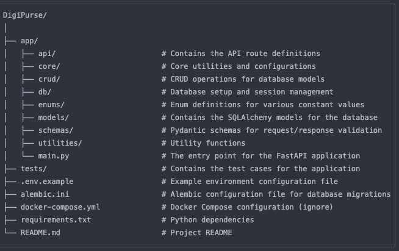

# DigiPurse

DigiPurse is a wallet system designed for developers who want to integrate wallet functionalities into their applications. Built with FastAPI and utilizing PostgreSQL as the database, DigiPurse offers a robust backend solution for managing user wallets, transactions, and loyalty points.

## Features

- **User Management**: Registration, authentication, and management of users.
- **Wallet Management**: Create, credit, debit, and refund user wallets.
- **Transaction Processing**: Immutable transaction records ensuring high auditability.
- **Loyalty Points System**: Reward users with loyalty points that can be converted back into wallet credits.

## Project Structure




## Code Quality

 [](https://sonarcloud.io/summary/new_code?id=Kachielite_digi-purse) [](https://sonarcloud.io/summary/new_code?id=Kachielite_digi-purse) [](https://sonarcloud.io/summary/new_code?id=Kachielite_digi-purse) [](https://sonarcloud.io/summary/new_code?id=Kachielite_digi-purse) [](https://sonarcloud.io/summary/new_code?id=Kachielite_digi-purse) [](https://sonarcloud.io/summary/new_code?id=Kachielite_digi-purse) [](https://sonarcloud.io/summary/new_code?id=Kachielite_digi-purse) [](https://sonarcloud.io/summary/new_code?id=Kachielite_digi-purse) [](https://sonarcloud.io/summary/new_code?id=Kachielite_digi-purse) [](https://sonarcloud.io/summary/new_code?id=Kachielite_digi-purse)

We use SonarCloud for code quality analysis. You can view the project overview and details on [SonarCloud](https://sonarcloud.io/project/overview?id=Kachielite_digi-purse).

## API Documentation

Access the full API documentation on Swagger UI: [here](https://digi-purse.onrender.com/docs)

## Architecture

The DigiPurse project follows a modular architecture to ensure scalability and maintainability. Below is an overview of the main components:

- **FastAPI**: The web framework used for building the API.
- **SQLAlchemy**: The ORM used for database interactions.
- **Alembic**: Used for database migrations.
- **Pytest**: Used for testing the application.

### Components

1. **app/main.py**: The entry point for the FastAPI application.
2. **app/models**: Contains the SQLAlchemy models for the database.
3. **app/api**: Contains the API route definitions.
4. **app/crud**: Contains the CRUD operations for the models.
5. **app/db**: Contains the database initialization and base class for models.
6. **app/schemas**: Contains the database initialization and base class for models.
7. **app/core**: Contains the core application settings and configurations.
8. **app/enum**: Contains the enums used across the application.
9. **app/utils**: Contains utility functions used across the application.
10. **alembic**: Contains the database migration scripts.
11. **tests**: Contains the test cases for the application.

### Data Flow

1. **Request Handling**: Incoming HTTP requests are handled by FastAPI in `app/main.py`.
2. **Routing**: Requests are routed to the appropriate endpoint defined in `app/api/routes.py`.
3. **Business Logic**: The business logic is processed, and database interactions are performed using SQLAlchemy models in `app/models`.
4. **Response**: The processed data is returned as an HTTP response.

### Database

- **PostgreSQL**: The primary database used for storing user, wallet, transaction, and loyalty data.
- **SQLAlchemy**: Used for ORM mapping and database interactions.
- **Alembic**: Used for managing database migrations.

### Testing

- **Pytest**: Used for writing and running test cases to ensure code quality and functionality.

## Database Models

### User Model

The User table stores the information of each user.

- `id`: Primary key, unique identifier for each user.
- `username`: Unique username of the user.
- `email`: Unique email address of the user.
- `phone_number`: Unique phone number of the user.
- `hash_password`: Hashed password for authentication.
- `role`: User role, which can be "SYS_ADMIN", "ADMIN", or "USER".
- `is_active`: Boolean flag indicating if the user is active.
- `created_at`: Timestamp when the user was created.
- `updated_at`: Timestamp when the user was last updated.

### Wallet Model

The Wallet table represents a wallet associated with a user.

- `id`: Primary key, unique identifier for each wallet.
- `user_id`: Foreign key referencing the user associated with the wallet.
- `user_phone_number`: Foreign key referencing the phone number of the user.
- `balance`: Current balance of the wallet.
- `is_blocked`: Boolean flag indicating if the wallet is blocked.
- `is_deleted`: Boolean flag indicating if the wallet is deleted.
- `created_at`: Timestamp when the wallet was created.
- `updated_at`: Timestamp when the wallet was last updated.

### Transaction Model

The Transaction table stores every transaction made through the wallet.

- `id`: Primary key, unique identifier for each transaction.
- `wallet_id`: Foreign key referencing the wallet associated with the transaction.
- `amount`: The transaction amount.
- `type`: Type of transaction: "credit", "balance", "debit", or "refund".
- `description`: Optional description of the transaction.
- `source`: Optional source information of the transaction.
- `created_at`: Timestamp when the transaction was created.
- `updated_at`: Timestamp when the transaction was last updated.

#### Immutable Records Approach

- **No Updates**: Transactions are immutable; once created, they cannot be updated or deleted.
- **Reversal Transactions**: For corrections, a new transaction negates the incorrect one, followed by the correct transaction.

### Loyalty Model

The Loyalty table stores loyalty points for each user.

- `id`: Primary key, unique identifier for each record.
- `user_id`: Foreign key referencing the user associated with the loyalty points.
- `points`: The current points the user has.
- `created_at`: Timestamp when the record was created.
- `updated_at`: Timestamp when the record was last updated.


## Getting Started

### Prerequisites

- Python 3.9+
- PostgreSQL
- FastAPI

### Installation

Clone the repository:

```bash
git clone https://github.com/yourusername/DigiPurse.git
cd DigiPurse
```

Create a virtual environment:

```bash
python -m venv venv
source venv/bin/activate
```

Install the dependencies:

```bash
pip install -r requirements.txt
```

Set up the environment variables:

```bash
cp .env.example .env
```

Update the `.env` file with your database credentials.

Run the migrations:

```bash
alembic upgrade head
```

Start the FastAPI server:

```bash
uvicorn app.main:app --reload
```

Start the FastAPI server:

```bash
uvicorn app.main:app --reload
```

Test the application:

```bash
pytest
```
